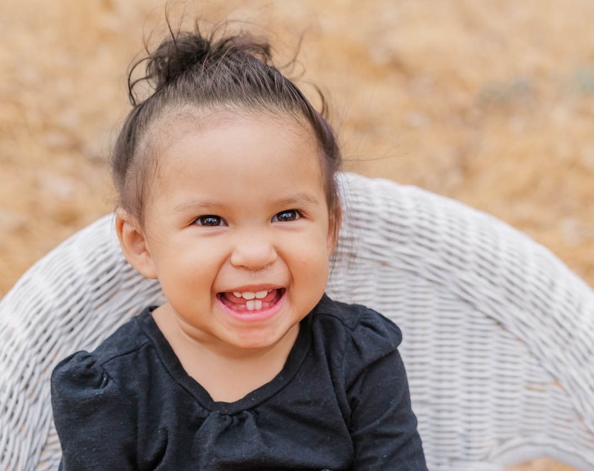
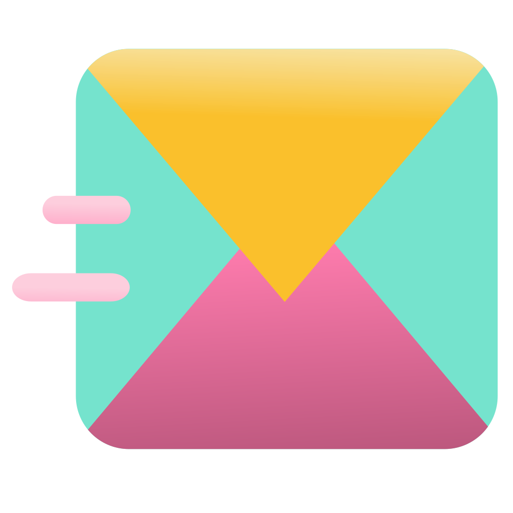

# Hello! I am Adriana

This wil be my main repository that will hold different activities while attending a coding cohort through MIT. So excited for all that will be learned!

There are so many things I would love to this too but in time, eventually it will happen!

#### Here are my socials:

<a href="https://github.com/adrigalle">
    
<a href="https://www.linkedin.com/in/adriana-gallegos-a2a992159">
       

